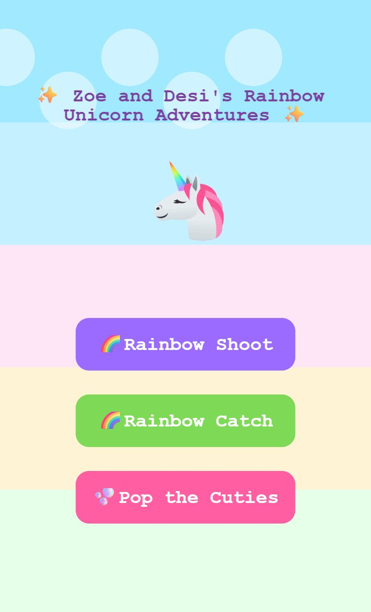
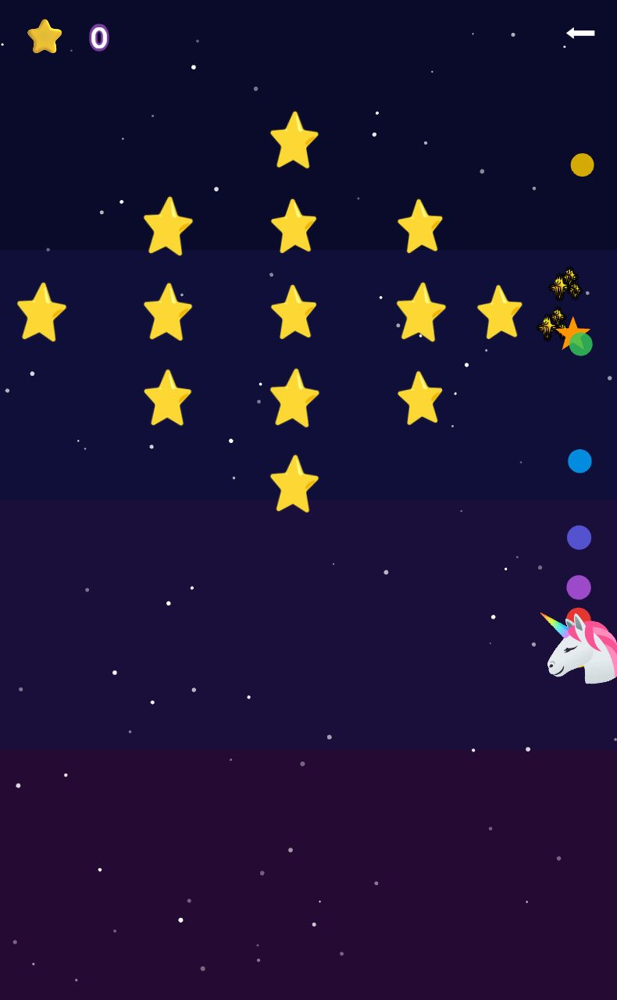
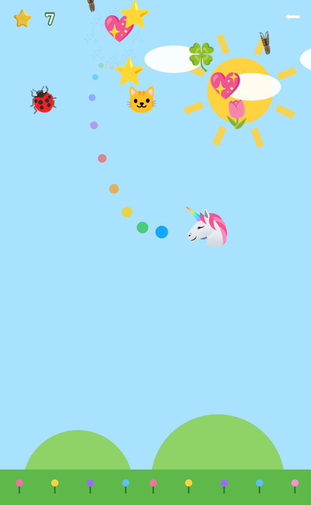
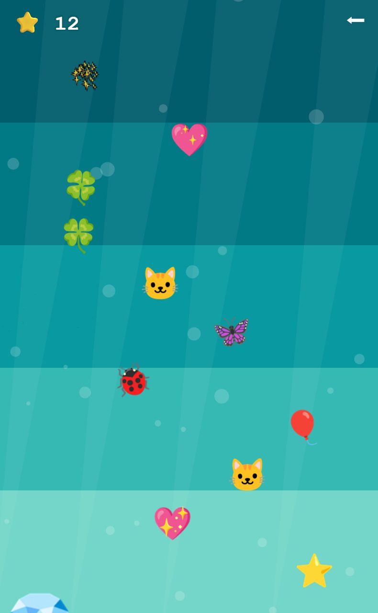

<h1 align="center">✨ Zoe and Desi's Rainbow Unicorn Adventures ✨</h1>

<p align="center">
  <em>A pink, sparkly, gloriously <strong>no-fail</strong> arcade made for two small humans —<br>
  where the only way to play is to have fun.</em> 🦄🌈
</p>

<p align="center">
  
</p>

<p align="center">
  
  
  
  
  
</p>

---

There are **no scores to lose, no game-overs, no lives, no menus to get stuck in** — just a smiling unicorn, a lot of cute things, and four little games you reach with one big tap. Built for a 4-year-old and her sibling, tuned so a toddler mashing the screen with both hands always feels like a hero.

## 🎮 Four games, one tap each

<table>
<tr>
<td width="33%" valign="top" align="center">
<br>
<b>🌈 Rainbow Shoot</b><br>
<sub>The unicorn flies through space and <b>auto-fires rainbow stars</b> at friendly cuties across 12 gentle levels with cuddly bosses. Just steer — it shoots for you. Bumping into things is a soft bounce, never a loss.</sub>
</td>
<td width="33%" valign="top" align="center">
<br>
<b>🌈 Rainbow Catch</b><br>
<sub>Cute treats tumble from the sky and the unicorn <b>catches them</b> with a generous, forgiving hitbox. It speeds up when you're on a roll and gently slows down when you miss — so it always finds your pace. Endless.</sub>
</td>
<td width="33%" valign="top" align="center">
<br>
<b>🫧 Pop the Cuties</b><br>
<sub>Cute emoji bubble up from the deep and you <b>poke them to pop</b> them into sparkles. Full <b>multi-touch</b> — mash with all ten fingers. A rare rainbow cutie clears the whole screen in a party.</sub>
</td>
</tr>
</table>

## 👆 How to play

- **Steer / aim:** drag with a finger, move the mouse, or use the arrow keys.
- **Rainbow Shoot** fires by itself. **Rainbow Catch** catches by overlap. **Pop the Cuties** pops whatever you tap (nearest cutie, generously).
- The **⬅ button** (top-right) always goes home. That's the whole control scheme.

## 💖 The no-fail promise

Everything is designed so a little kid can't get stuck, can't lose, and can't accidentally quit:

- No score to drop, no lives, no "Game Over," no death screens.
- Difficulty **self-balances** to the player instead of punishing them.
- No reading required, no menus, no ads, no purchases, no accounts, **no data collected**, nothing saved.
- Celebrations everywhere — confetti, fanfares, and sparkle bursts for doing basically anything.

## 🚀 Run it yourself

```bash
npm install
npm run dev      # open the printed URL
npm test         # run the logic tests (Vitest)
npm run build    # production build → dist/ (also emits the PWA service worker)
```

## 📱 Put it on a kid's phone (one-time)

1. Open the deployed link in the phone browser.
2. **Add to Home Screen** (iPhone: Share ⬆️ → Add to Home Screen · Android: menu → Install app). Now it has its own icon and runs full-screen as an app.
3. **Lock them into the game** so a stray swipe can't escape it:
   - **iPhone:** Settings → Accessibility → **Guided Access** → On. Open the game, triple-click the side button to start. Triple-click + passcode to exit.
   - **Android:** Settings → Security → **Screen pinning** → On. Open the game, open recents, tap the icon → Pin.

### Deploy (Netlify)

Connect the repo on Netlify with build command `npm run build` and publish dir `dist` (or drag the built `dist/` folder straight in). You'll get a link like `https://your-site.netlify.app`.

## 🛠️ Under the hood

- **[Phaser 4](https://phaser.io/) + TypeScript + Vite**, shipped as an installable **PWA** (offline-capable via a service worker).
- **Pure game logic lives in `src/core/`** with **zero** Phaser imports, unit-tested with **Vitest** — the self-balancing speed ladder, formations, collision, and tap-targeting are all testable without a browser.
- **Animated [Google Noto emoji](https://googlefonts.github.io/noto-emoji-animation/)** (Apache-2.0) are decoded into sprite sheets at build time (`scripts/build-emoji.mjs`) and played as looping Phaser animations. The unicorn is its own animated sheet; the sparkle burst uses the [OpenMoji](https://openmoji.org/) atlas.
- Each mode has its own shape-drawn background (rainbow sky, starfield, meadow, underwater) — no heavy image backgrounds.

### Asset-build scripts

| Script | What it does |
|---|---|
| `npm run emoji` | Downloads Noto emoji → sprite sheets + manifest |
| `npm run audio` | Generates the sound effects |
| `npm run catch-audio` | Fetches the Rainbow Catch music playlist |
| `npm run pop-audio` | Fetches the Pop the Cuties track (default: *Wallpaper*) |
| `npm run gumball-audio` | Fetches the Unicorn Gumballs track (default: *The Builder*) |
| `npm run aquarium-audio` | Fetches the Tap the Aquarium track (default: *Carefree*) |
| `npm run aquarium-sfx` | Synthesizes the aquarium reaction sounds (blub / sproing / chime) |
| `npm run catch-unicorn` | Builds the animated unicorn sprite sheet |
| `npm run icons` | Generates the PWA icons |

## 🙏 Credits

- Music by **Kevin MacLeod** ([incompetech.com](https://incompetech.com)) — CC-BY 4.0. See [`public/audio/CREDITS.md`](public/audio/CREDITS.md).
- Emoji art: **Google Noto Emoji** (Apache-2.0) and **OpenMoji** (CC BY-SA 4.0).
- Made with 💜 for **Zoe and Desi**.
